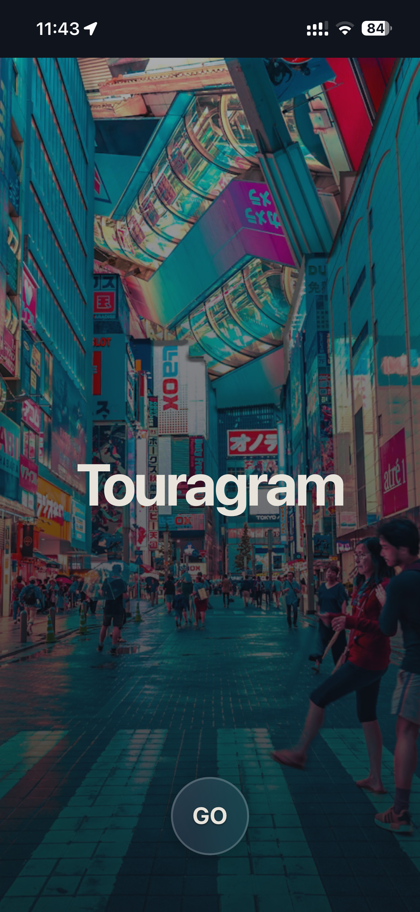
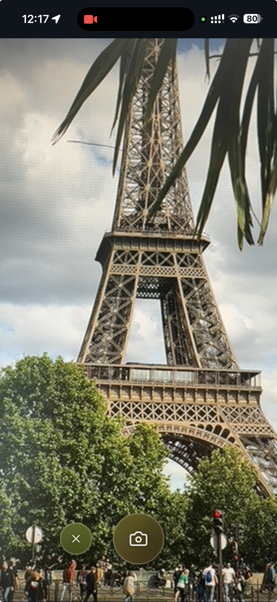
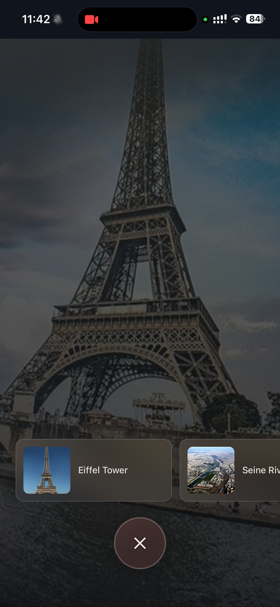
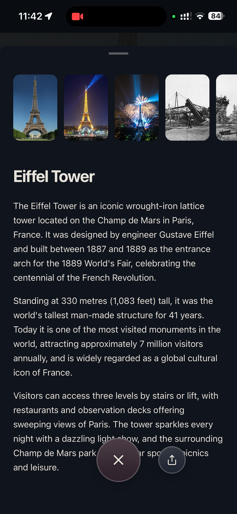

# Touragram

Point your phone at a landmark and it tells you what you're looking at, with a
short history and real photos of the place.

|  |  |  |  |
|:--:|:--:|:--:|:--:|
| Welcome | Camera | Result | Detail |

## What it does

Open it, point the camera at a building, monument, or view, and tap the
shutter. A moment later it shows you what you're looking at: the name, a couple
of paragraphs on its history and why it matters, and a gallery of photos. Tap a
result to read more. It works for landmarks anywhere, not a fixed list of
places.

## How it works

When you take the shot, the app sends the photo **and** your GPS location to
Anthropic's Claude API. The photo is the main clue; the location helps it tell
apart things that look alike (the tower you're pointing at is the one in *this*
city). Claude identifies the most likely landmarks, and the app then pulls real
photographs of each one from Wikipedia to build the gallery.

## Tech

A personal learning project, built from fundamentals on purpose: plain HTML,
CSS, and JavaScript, with no frameworks and no build step. The only moving part
beyond that is a single Vercel serverless function that handles the AI
identification (so the API key stays server-side) and the Wikipedia photo
lookup. The point was to understand how the pieces actually fit together before
reaching for tools that hide them.

The interface is built on a small custom design system (dark theme,
liquid-glass buttons, a handful of tokens and components), written up in
[docs/design-system.md](docs/design-system.md).
