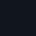
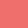
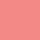
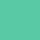
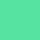

# Touragram Design System

A small, custom design system built for this app from plain CSS, with no
framework and no UI library. It exists so the screens stay visually consistent
and so styling decisions are made once, in tokens, rather than re-guessed per
screen. This documents the real decisions behind it.

## Direction: dark only

Touragram is a camera app: the UI floats over a live viewfinder and photos, and
a near-black surface keeps the focus on the imagery. A light theme would fight
that, so there isn't one. Dark screens also draw less battery on phone OLED
displays, which matters when you're touring a city all day.

## Tokens: two tiers

Design values live in CSS custom properties in two tiers: **primitives**
(`styles/tokens/primitives.css`, the raw colour/space/type/radius/motion values)
and **semantic** roles (`styles/tokens/semantic.css`, like `--surface-base`,
`--ink-primary`, `--accent-default`) that map onto them. Components use the
semantic roles, so changing a primitive updates every component that references
it.

## Colour

| | Token | Hex | Role |
| --- | --- | --- | --- |
|  | `--color-neutral-0` | `#10141C` | page background |
|  | `--color-neutral-1` | `#465775` | raised surface |
|  | `--color-neutral-2` | `#5B6C5D` | borders |
|  | `--color-neutral-3` | `#B5B6C2` | secondary ink |
|  | `--color-neutral-4` | `#E8E4DC` | primary ink (cream) |
|  | `--color-accent-default` | `#EF6F6C` | accent (coral) |
|  | `--color-accent-hover` | `#F38986` | accent hover |
|  | `--color-danger` | `#B83A3A` | danger |
|  | `--color-success-default` | `#59C9A5` | success |
|  | `--color-success-hover` | `#56E39F` | success hover |

## Typography

One family: a system sans stack (`--font-sans`). Weights are
regular/medium/semibold/bold; tracking tokens include a tight `-0.04em` for
large display text.

| Token | rem | px | Usage |
| --- | --- | --- | --- |
| `--text-xs` | 0.75 | 12 | fine print |
| `--text-sm` | 0.875 | 14 | labels, captions |
| `--text-base` | 1 | 16 | body |
| `--text-md` | 1.125 | 18 | emphasised body |
| `--text-lg` | 1.25 | 20 | small headings |
| `--text-xl` | 1.5 | 24 | headings |
| `--text-2xl` | 1.875 | 30 | section titles |
| `--text-3xl` | 2.25 | 36 | large titles |
| `--text-4xl` | 3 | 48 | display |
| `--text-5xl` | 3.75 | 60 | hero wordmark |

## Space, radius, motion

| Token(s) | Value | For |
| --- | --- | --- |
| `--space-1` to `--space-9` | 0.25rem to 6rem | padding, gaps, rhythm (`--space-5` = 1.5rem is the standard screen margin) |
| `--radius-sm` to `--radius-lg` | 4px to 12px | corner rounding |
| `--radius-full` | 9999px | pills and circles |
| `--duration-fast` / `--duration-base` | 120ms / 200ms | transitions |
| `--ease-out` | cubic-bezier(0.16, 1, 0.3, 1) | easing curve |

## Liquid-glass buttons

Buttons are three-layer translucent glass that refracts whatever is behind them,
in two variants: **primary** (warm coral tint, for the main action) and
**ghost** (near-neutral and more transparent, for secondary actions). On iOS
Safari, which renders the glass filter unreliably, they degrade to plain
frosted glass rather than breaking.

## Components and layouts

| Piece | File | Purpose |
| --- | --- | --- |
| button | `components/button.css` | the liquid-glass buttons; sizes sm/md/lg, primary/ghost, circle shape |
| card | `components/card.css` | glass cards for landmark results and photo thumbnails |
| sheet | `components/sheet.css` | bottom sheet for landmark detail, drag to dismiss |
| screen | `layouts/screen.css` | full-viewport frame plus the bottom-actions pattern |
| carousel | `layouts/carousel.css` | horizontal scroll-snapping row for cards and the gallery |

## Principles

Built on a few principles kept in the project's internal notes: style through
semantic tokens, and extract a shared component only on the rule of three.

The live, interactive reference for these tokens and components is the internal
`styleguide.html` page (not linked publicly).
